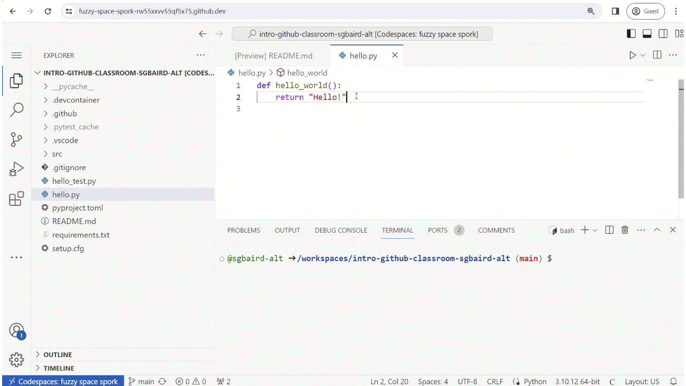
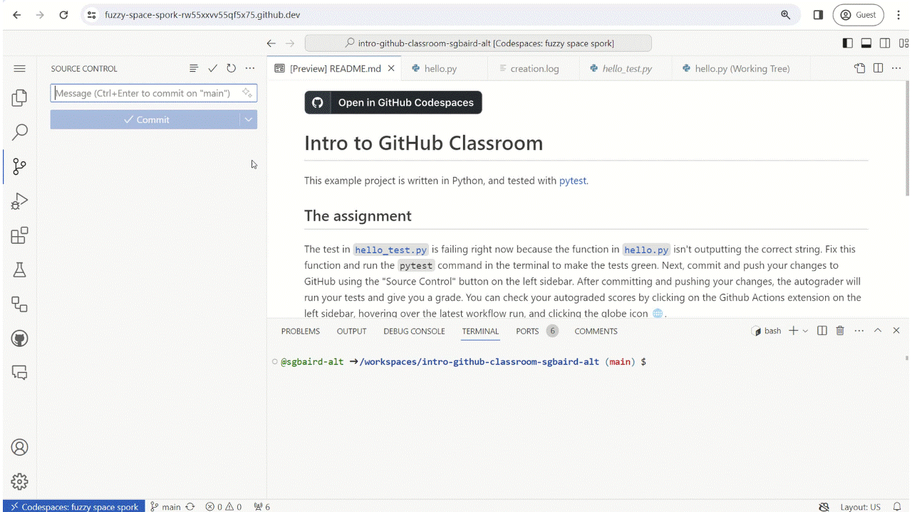

# Intro to GitHub Classroom
This example project is written in Python, and tested with [pytest](https://www.python.org/).

## The assignment

The test in [`hello_test.py`](hello_test.py) is failing right now because the function in [`hello.py`](hello.py) isn't outputting the correct string. Fix this function and run the `pytest` command in the terminal to make the tests green.

Next, open the "Source Control" button on the left sidebar, write a commit message, and commit and push your changes to GitHub.

After committing and pushing your changes, the autograder will run your tests and give you a grade. To check your autograded scores, click on the GitHub Actions extension on the left sidebar, click the refresh button at the top-right corner of the sidebar, hover over the latest workflow run, and click the globe icon 🌐. Next, click the "Autograding" job button, click the dropdown for the "Run education/autograding" step, and scroll down to see your grade.

▶️ If you get stuck, refer to [the walkthrough video](https://github.com/AC-Classroom/intro-github-classroom/assets/45469701/93760bf7-0d27-49dc-8f66-7d50d428677f).